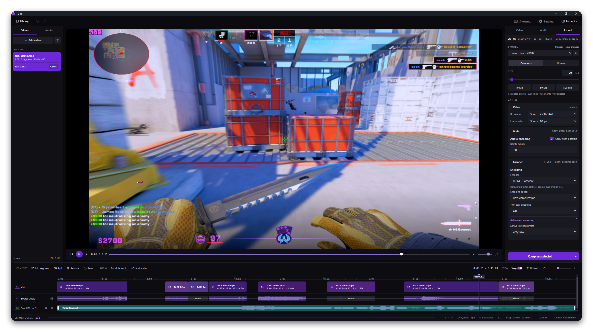

<div>
<h1 align="center">
  <a href="https://github.com/aechXIII/Tuck"></a>
  <br>
  Tuck
</h1>

<p align="center"><strong>Trim, compress, and upscale videos on Windows.</strong></p>

<p align="center">
    <a href="https://github.com/aechXIII/Tuck/releases/latest"></a>
    <a href="https://github.com/aechXIII/Tuck/releases"></a>
    
    <a href="LICENSE"></a>
  <a href="https://x.com/aechxiii">
  
</a>
  </p>
</div>

---

> [!NOTE]
> **Microsoft Defender false positive resolved**
>
> Microsoft reviewed Tuck 0.3.2 and the 0.3.3 release candidate and removed the false-positive cloud detection. Both files are classified as not malware.
>
> If Defender still reports an older detection, open Windows Security, go to **Virus & threat protection > Protection updates**, and select **Check for updates**.

Tuck is a lightweight Windows video "editor", compressor, and upscaler built around FFmpeg. Use it to quickly remove unwanted segments, add or modify audio tracks, crop or transform the video and after that - export to a desired file size or resolution.



## Download

Tuck supports Windows 10 and 11. The installer includes the Microsoft Edge WebView2 setup, but FFmpeg must be installed separately.

1. Download the latest installer from the [Releases page](https://github.com/aechXIII/Tuck/releases/latest), then run it.

2. Install FFmpeg and FFprobe:

   ```powershell
   winget install --exact --id Gyan.FFmpeg
   ```

3. Restart Tuck.

If `winget` is unavailable, install a Windows build from the [FFmpeg download page](https://ffmpeg.org/download.html). Make `ffmpeg.exe` and `ffprobe.exe` available in `PATH` or select them under
**Settings > System & support > Advanced system settings**.

## Features

- **Timeline editing:** Split a video into segments, trim or remove unwanted parts, and mute source audio or individual fragments.
- **Audio editing:** Add new audio files and position them on the timeline. Imported audio can be moved, trimmed, split, muted, or given its own volume level.
- **Crop and resize:** Crop directly in the preview, rotate in 90-degree steps, flip the
  picture horizontally or vertically, and choose **Fit**, **Fill**, or **Stretch** for the
  output frame.
- **Compression and upscaling:** Compress to a chosen file-size limit, or upscale to 1440p, 4K, or a custom resolution. Built-in profiles cover [Discord's](https://support.discord.com/hc/en-us/articles/25444343291031-File-Attachments-FAQ) 20 MB, 50 MB, and 500 MB upload limits.
- **Encoding queue:** Encode with FFmpeg using software or supported NVIDIA and AMD hardware. Queue multiple videos, reorder pending exports, cancel a pending or running export, and retry failed or cancelled exports.
- **Profiles and Windows integration:** Save reusable profiles, import or export profiles, drag videos into Tuck, and add Tuck or a specific profile to File Explorer's **Send To** menu.

## Use

1. Add one or more videos and select the clip you want to edit.
2. Make any timeline, audio, crop, or sizing changes.
3. Choose **Compress** or **Upscale**, select a profile, and start the export.

## Command line

The installer adds `tuck` to `PATH`. Open a new terminal after installing Tuck.

```powershell
tuck profiles list
tuck probe clip.mp4
tuck compress clip.mp4 --profile discord-50mb
tuck compress clip.mp4 --size 25
tuck upscale clip.mp4 --to 1440p
tuck upscale clip.mp4 --resolution 2560x1440
```

Run `tuck --help` for the complete command list.

## Support

If an export fails, open **Settings > System & support**, choose **Copy diagnostics**, and
include the report in a [GitHub issue](https://github.com/aechXIII/Tuck/issues). Tuck removes local file paths from the report.

## Build from source

Running Tuck from source requires Windows, Python 3.10 or newer, and FFmpeg:

```powershell
.\scripts\setup.ps1
.\scripts\run.ps1
```

Create a packaged build with:

```powershell
.\scripts\build.ps1 -Clean
```

Building the installer also requires [Inno Setup 6](https://jrsoftware.org/isdl.php):

```powershell
.\scripts\build.ps1 -Clean -Installer
```

## License

Tuck is available under the [GNU General Public License v3.0 only](LICENSE).
