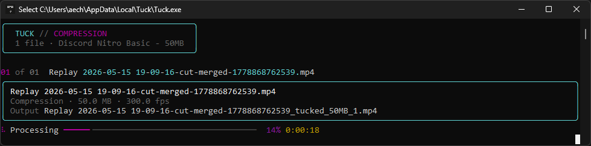

# Tuck

Windows video compressor and upscaler. Built for Discord limits, but useful for any FFmpeg job that needs a smaller file or to upscale a video for YouTube.

[](https://github.com/aechXIII/Tuck/releases) [](LICENSE) []() [](https://buymeacoffee.com/aechxiii)


https://github.com/user-attachments/assets/532317a7-e628-455e-b041-4aeceef810b5


<details>
<summary>Send To</summary>



</details>

## Features

**Compress**
- Default Discord presets for 10 MB, 50 MB, and 500 MB files
- Two-pass encoding with target-size retries; outputs over the configured limit are never published
- Auto (best compression) prefers software quality per byte; Auto (fastest available) prefers usable NVIDIA or AMD hardware
- CPU, NVIDIA, and AMD H.264/H.265 encoders; explicitly selected encoders fail clearly rather than switching automatically
- Trim clips with the two-handle timeline before encoding

**Upscale**
- Default 1440p and 4K presets
- Quality-based encoding with CRF or CQP
- Choose the scaler you prefer

**Profiles and queue**
- Edit, copy, import, and export profiles
- Process several files in order, drag to reorder pending jobs, and see stage, pass, speed, ETA, and retry progress
- Cancel an individual pending or running job; retry failed or cancelled jobs with their original requested trim and encode settings
- Stop after the current job or automatically clear completed jobs; failed and cancelled jobs remain available for inspection or retry
- Keep source resolution and FPS, or set limits per profile
- Copy sanitized diagnostics for support without exposing local paths

**Windows**
- Drag files into the app
- Add Tuck or a profile to the File Explorer Send To menu
- Check GitHub Releases for updates

## Install

1. Download the latest release from [Releases](https://github.com/aechXIII/Tuck/releases).
2. Run the installer. It installs Tuck to `%LOCALAPPDATA%\Tuck`.
3. Start Tuck from the Start menu or File Explorer Send To menu.

Tuck needs Windows 10 or 11, [WebView2](https://developer.microsoft.com/en-us/microsoft-edge/webview2/), and FFmpeg.

Install FFmpeg from PowerShell, then restart Tuck:

```powershell
winget install -e --id Gyan.FFmpeg
```

If `winget` is unavailable, download a Windows build from [FFmpeg](https://ffmpeg.org/download.html). Extract `ffmpeg.exe` and `ffprobe.exe` to `C:\ffmpeg\bin`. You can also set custom FFmpeg and FFprobe paths in **Settings**.

## Use

1. Add one or more video files and optionally trim the selected clip on the timeline.
2. Select a compression or upscale profile and encoder. Use **Auto** to try compatible usable hardware candidates before CPU.
3. Start the queue. Pending jobs can be reordered; pending or running jobs can be cancelled; failed or cancelled jobs can be retried without changing the original request. Stop after the current job or clear completed jobs automatically as needed.
4. Use **Settings > System > Copy diagnostics** after a failure to copy a path-sanitized support report.

For File Explorer, select video files, right-click them, then use **Send To > Tuck**. You can also add profile-specific shortcuts from Tuck settings.

## Command line

After installing, use `tuck` from a new terminal:

```powershell
tuck profiles list
tuck probe video.mp4
tuck compress video.mp4 --profile discord-50mb
tuck compress video.mp4 --size 25
tuck upscale video.mp4 --to 1440p
tuck upscale video.mp4 --resolution 2560x1440
```

Run `tuck --help` for all commands.

## Build from source

Requires Python 3.10 or newer. Install [Inno Setup 6](https://jrsoftware.org/isdl.php) to build the installer.

```powershell
.\scripts\setup.ps1
.\scripts\run.ps1
```

```powershell
.\scripts\build.ps1 -Clean
.\scripts\build.ps1 -Clean -Installer
```

Run the checks before a release:

```powershell
pytest
ruff format --check tuck/ tests/
ruff check tuck/ tests/
pyright tuck/
```

The app build is in `dist\Tuck\`. The installer is in `scripts\Output\`.

## License

MIT. See [LICENSE](LICENSE).
